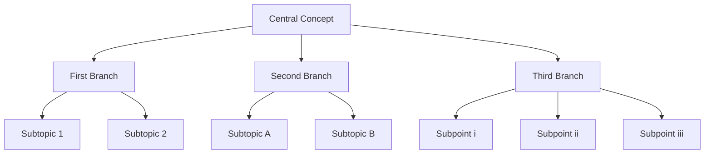

## Mindmap

## Activity Windesheim

| Activity at Windesheim                                                        | Agree with it? | Fits Self-Image? | Notes                                                                 |
|-------------------------------------------------------------------------------|----------------|------------------|-----------------------------------------------------------------------|
| Leading the Spark! Living Lab                                                 | ✅              | ✅                | Initiated and shaped this innovation lab yourself                     |
| Designing blockchain supply chain simulations                                 | ✅              | ✅                | Aligned with tech and sustainability                                  |
| Agile transformation projects in logistics education                          | ✅              | ✅                | Change agent and systems thinker                                      |
| Supporting digitization of supply chain finance education                     | ✅              | ✅                | Matches research and fintech work                                     |
| Conducting forensic COVID-19 research with students                           | ✅              | ✅                | Rapid adaptation, involved students                                   |
| Representing Windesheim externally (conferences, panels, EU projects)         | ❓              | ❓                | Depends on framing and autonomy                                       |
| Administrative coordination (e.g., planning, reporting, meetings)             | ⚠️              | ❌                | Draining/admin heavy, misaligned                                      |
| Enforcing top-down decisions or curriculum constraints                        | ❌              | ❌                | Contradicts autonomy and co-creation                                  |
| Mentoring entrepreneurial student projects                                    | ✅              | ✅                | Coaching and innovation-aligned                                       |
| Acting as liaison between different lectoraten or departments                 | ✅              | ⚠️                | Helpful but risks overextension                                       |
