# Chris's wants to become

# 🌱 Chris' Aspiration Summary

Chris wants to become someone who:

- **Lives with autonomy**, making intentional choices aligned with personal values rather than reacting to external pressure.
- **Builds deep competence** by completing meaningful work, learning continuously, and applying skills in real-world contexts (e.g., project management, data-driven decision-making).
- **Feels connected** through healthy, reciprocal relationships and collaboration, especially in purpose-driven communities.
- **Takes responsibility** for life direction, including improving organization, follow-through, and financial discipline.
- **Treats himself with care**, practicing self-discipline and kindness as if he were someone he was responsible for helping.
- **Overcomes self-sabotage** by replacing impulsive habits and fear-driven behavior with small, steady, sustainable actions.
- **Leads by example**, contributing to systems change and sustainability through real-world projects and ethical facilitation.
- **Becomes reliable and trustworthy**, regaining the confidence of peers and building strong working relationships.

> _"If Chris stopped doing what he knows is bad for him, he would become confident, self-directed, and capable of building the life and impact he envisions."_ 💡

# 🌟 Chris's Ideal Self-Image

Chris envisions himself as a grounded, capable, and respected individual who:

## 🧭 Autonomy
- Lives deliberately, not reactively.
- Sets and protects his boundaries with confidence and clarity.
- Chooses projects and relationships that align with his personal values and long-term vision.
- Is not afraid to walk away from situations that compromise his integrity or growth.

## 🛠️ Competence
- Is known for his reliability, follow-through, and ability to deliver under pressure.
- Masters high-impact skills like systems design, facilitation, and data-driven decision-making.
- Turns abstract ideas into tangible outcomes — workshops, tools, visual maps, or strategic plans.
- Keeps promises — even small ones — to himself and others.

## 🤝 Relatedness
- Builds trust through honesty, humility, and sustained contribution.
- Is part of a mutually supportive network of collaborators, friends, and peers.
- Communicates with emotional maturity: listening deeply, expressing clearly, and repairing when needed.
- Has one or two core relationships where he feels truly seen, understood, and valued.

## 🧠 Mindset
- Practices self-discipline without shame or punishment.
- Balances vision with realism — not overreaching, but always evolving.
- Accepts fear and failure as part of growth, not signs of inadequacy.
- Maintains rituals for focus, reflection, and momentum.

> _"Chris’s ideal self is not perfect — but he’s accountable, evolving, and committed to becoming someone he can trust."_ 💬

## Mindmap

```mermaid
graph TD
    Chris[Chris: Ideal Self]

    %% Core Needs
    Chris --> Autonomy
    Chris --> Competence
    Chris --> Relatedness
    Chris --> Mindset

    %% Autonomy Branch
    Autonomy --> A1[Lives deliberately]
    A1 --> A1a[Weekly planning session Sunday reset]
    A1 --> A1b[Document goals in personal system]

    Autonomy --> A2[Sets boundaries clearly]
    A2 --> A2a[Practice saying no to low-priority asks]
    A2 --> A2b[Define work/life hours visibly]

    Autonomy --> A3[Chooses aligned projects]
    A3 --> A3a[Score opportunities by value match]
    A3 --> A3b[Keep a “Why I said yes” log]

    Autonomy --> A4[Walks away from misaligned roles]
    A4 --> A4a[Recognize energy-draining commitments]
    A4 --> A4b[Use “exit script” to leave gracefully]

    %% Competence Branch
    Competence --> C1[Delivers reliably]
    C1 --> C1a[3 priority tasks every day]
    C1 --> C1b[Weekly review with accountability partner]

    Competence --> C2[Masters key skills]
    C2 --> C2a[Complete PM or data viz course]
    C2 --> C2b[Apply weekly in real projects]

    Competence --> C3[Turns ideas into outcomes]
    C3 --> C3a[Run idea-to-impact sprints]
    C3 --> C3b[Keep a done list of shipped outputs]

    Competence --> C4[Keeps promises]
    C4 --> C4a[Track commitments in single dashboard]
    C4 --> C4b[Limit verbal promises — make them measurable]

    %% Relatedness Branch
    Relatedness --> R1[Builds trust]
    R1 --> R1a[Follow through consistently]
    R1 --> R1b[Repair missteps openly]

    Relatedness --> R2[Nurtures deep connections]
    R2 --> R2a[Monthly call or visit with key people]
    R2 --> R2b[Send one unsolicited encouragement per week]

    Relatedness --> R3[Communicates maturely]
    R3 --> R3a[Use nonviolent language “I feel… when…”]
    R3 --> R3b[Pause before replying in conflict]

    Relatedness --> R4[Feels valued in close relationships]
    R4 --> R4a[Ask “what’s working for you in us?”]
    R4 --> R4b[Celebrate relational progress]

    %% Mindset Overlay
    Mindset --> M1[Disciplined but kind to self]
    M1 --> M1a[Treat yourself like someone you’re responsible for helping]
    M1 --> M1b[Don’t shame mistakes — use them as info]

    Mindset --> M2[Balances vision with realism]
    M2 --> M2a[Break big ideas into 1–2 week goals]
    M2 --> M2b[Track what’s working not just what’s missing]

    Mindset --> M3[Accepts failure as growth]
    M3 --> M3a[Keep a “lesson learned” journal]
    M3 --> M3b[Share small failures publicly]

    Mindset --> M4[Practices reflection and focus rituals]
    M4 --> M4a[5-minute nightly review What went well?]
    M4 --> M4b[Weekly solitude or nature walk]


```

## Activity Windesheim

| Activity at Windesheim                                                        | Agree with it? | Fits Self-Image? | Notes                                                                 |
|-------------------------------------------------------------------------------|----------------|------------------|-----------------------------------------------------------------------|
| Leading the Spark! Living Lab                                                 | ✅              | ✅                | Initiated and shaped this innovation lab yourself                     |
| Designing blockchain supply chain simulations                                 | ✅              | ✅                | Aligned with tech and sustainability                                  |
| Agile transformation projects in logistics education                          | ✅              | ✅                | Change agent and systems thinker                                      |
| Supporting digitization of supply chain finance education                     | ✅              | ✅                | Matches research and fintech work                                     |
| Conducting forensic COVID-19 research with students                           | ✅              | ✅                | Rapid adaptation, involved students                                   |
| Representing Windesheim externally (conferences, panels, EU projects)         | ❓              | ❓                | Depends on framing and autonomy                                       |
| Administrative coordination (e.g., planning, reporting, meetings)             | ⚠️              | ❌                | Draining/admin heavy, misaligned                                      |
| Enforcing top-down decisions or curriculum constraints                        | ❌              | ❌                | Contradicts autonomy and co-creation                                  |
| Mentoring entrepreneurial student projects                                    | ✅              | ✅                | Coaching and innovation-aligned                                       |
| Acting as liaison between different lectoraten or departments                 | ✅              | ⚠️                | Helpful but risks overextension                                       |
